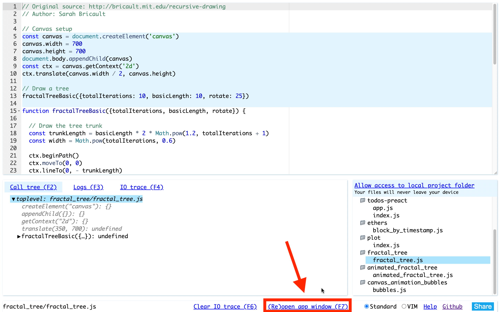
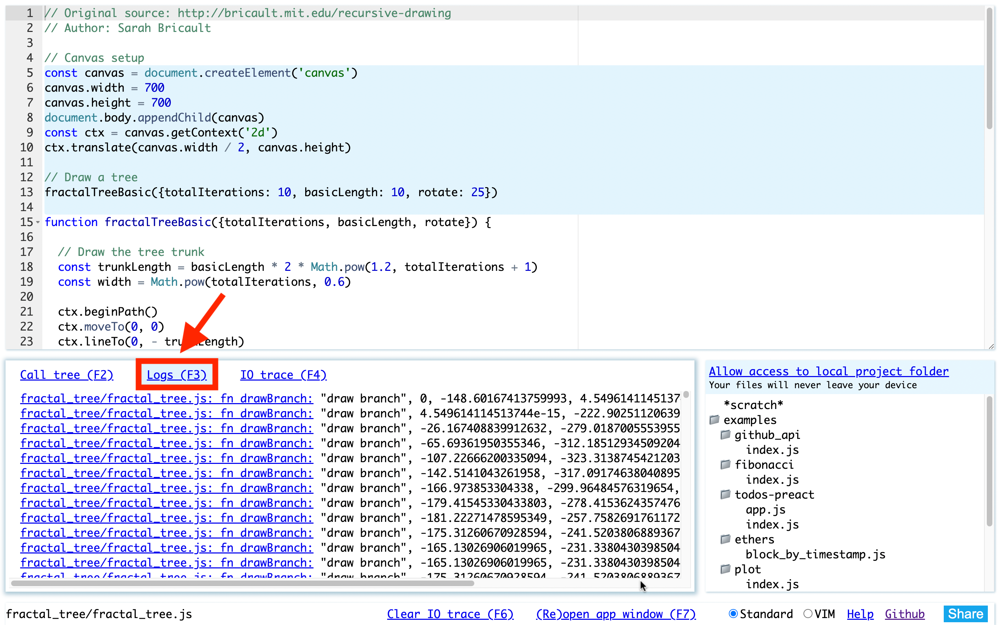

# 2D graphics and animation with time-travel debugging in JavaScript

Leporello.js теперь позволяет программировать 2d графику и анимацию с использованием [Canvas 2d API](https://developer.mozilla.org/en-US/docs/Web/API/CanvasRenderingContext2D), и отлаживать ее с использованием time travel дебаггинга.

Посмотрите короткую демку:

<video src='./media/tree.mov' controls></video>

Красивая картинка дерева на видео сгенерирована коротким и элегантным кодом на JavaScript, который я позаимствовал из великолепной статьи [Recursive Drawing](http://bricault.mit.edu/recursive-drawing) Sarah Bricault. Дерево рисуется рекурсивно - каждая ветка нарисована одной и той же функцией, меняются только параметры размера, цвета и наклона.

Код выполняется в среде Leporello.js. В верхней части вы видите редактор с кодом. В нижней части вы видите Call tree view, в котором отображено дерево вызовов функций в программе. Вы можете перемещаться по call tree view с помощью кликов мышкой или с помощью стрелочек на клавиатуре. Выбирая определенный вызов функции, вы перемещаетесь во времени на момент этого вызова. Вы можете обозревать значения аргументов функций, локальных переменных, и всех промежуточный выражений на момент выбранного вызова. При этом 2d canvas отображает картинку на тот момент, как она выглядела на момент вызова функции.

Вы можете попробовать этот пример самостоятельно онлайн <a href='https://app.leporello.tech?example=fractal_tree' target="__blank">тут</a>. После того как вы пройдете по ссылке, нажмите на кнопку "Re(open) app window":



После нажатия на кнопку, откроется новая вкладка браузера, в которой и будет отрисована картинка с деревом. Вы можете вынести эту вкладку в отдельное окно, и расположить его у себя на мониторе так, как вам удобно. После этого нажимайте на элементы calltree мышкой или двигайтесь по ним стрелочками на клавиатуре, и наблюдайте как картинка с деревом отрисовывается по ходу выполнения программы!

## Time-travel с использованием `console.log`

Вы можете заметить, что перед рисованием кусочка ветви дерева мы вызываем функцию `console.log`:

```
console.log('draw branch', x1, y1, x2, y2)
```

Вывод функции `console.log` отображается снизу в панели `Logs`:



Нажимая мышкой на строчки, выведенные в лог, вы переноситесь к соответствующему вызову функции `console.log` в редакторе. При этом картинка, нарисованная на канвасе, также откатывается к моменту вызова функции `console.log`. Зажимая и удерживая верхнюю или нижнюю стрелку на клавиатуре, мы быстро перемещаемся по вызовам `console.log`, при этом соответственно меняется нарисованная картинка. Можно двигаться как в прямом, так и в обратном направлении:

<video src='./media/log_debug.mov' controls></video>

## Анимируем рисование

Теперь немного изменим код, чтобы рисование происходило не мгновенно, а вместо этого перед рисованием каждого кусочка делалась небольшая задержка. Добавим модификатор `async` к функции рисования ветви, и будет вызывать ее с использованием ключевого слова `await`. Кроме того, добавим функцию `sleep`, и будем вызывать ее каждый раз после того как нарисуем кусочек:

```
function sleep() {
  return new Promise(resolve => setTimeout(resolve, 3))
}

//...

await sleep()
```

Таким образом мы получим такую анимацию как на видео. Вы можете попробовать этот пример сами, пройдя по <a href='https://app.leporello.tech/?example=animated_fractal_tree' target="__blank">ссылке</a>:

<video src='./media/tree_animated.mov' controls></video>

Обратим внимание, что отладка программы с помощью calltree view ничуть не изменилась по сравнению с предыдущим примером. Leporello может визуализировать calltree как для синхронного, так и для асинхронного кода.

Чтобы перезапустить анимацию, обновите (Ctrl-R) окно в котором запущено приложение.

## Анимация с использованием `setInterval`

Leporello.js также позволяет отлаживать анимацию в time-travel манере. Для анимации на javascript применяется функция `setInterval(callback, delay)`, которая повторно вызывает функцию `callback` через промежуток времени равный `delay`.

Рассмотрим такой пример, который я позаимствовал с сайта [freeCodeCamp](https://www.freecodecamp.org/news/how-to-create-animated-bubbles-with-html5-canvas-and-javascript/). Вы можете попробовать этот пример самостоятельно <a href='https://app.leporello.tech/?example=canvas_animation_bubbles' target='__blank'>по ссылке</a>:

<video src='./media/bubbles.mov' controls></video>

В calltree view вы можете видеть секцию под названием `deferred calls`. Это вызовы функций, который были выполнены не в результате выполнения модуля, а в результате работы event loop браузера, как реакция на события.

В нашем примере мы видим в списке deferred calls вызов функции `createCircles` как реакцию на клик по канвасу, и затем вызов функции `animate`, котарая вызывается благодаря функции `setInterval`. Мы можем перемещаться по списку deferred calls вперед и назад стрелочками на клавиатуре или кликами мышкой. При этом картинка на канвасе откатывается на момент выбранного вызова:

<video src='./media/debug_bubbles.mov' controls></video>

Обратите внимание, что код примера организован таким образом, что анимация останавливается, когда фокус уходит из окна. Это сделано, чтобы не тратить большое количество памяти. Если анимация будет проигрываться слишком долго, то перерисовка при перемещении по calltree view может стать очень медленной. Leporello.js не знает, что анимация состоит из отдельных кадров, и каждый кадр начинается с полной очистки канваса. Поэтому Leporello.js вынуждена каждый раз повторно применять все операции рисования, начиная с первого кадра до выбранного кадра включительно.

## Time-travel debugging and mutable data

Leporello.js содержит в себе [time-travel engine](/blog/mutable_data/), который позволяет обозревать данные на выбранный момент времени. Продемонстрируем, как это работает в вышеприведенном примере с анимацией. Выберем первый вызов функции `createCircles` в списке `deferred calls` и перенесемся в редактор. Обратим внимание на код, который создает bubbles:

```
circles = circles.concat(Array.from({length: 50}, () => (
   {
    x: event.pageX,
    y: event.pageY,
    radius: Math.random() * 50,
    dx: Math.random() * 0.3,
    dy: Math.random() * 0.7,
    hue: 200,
  }
)))
```

Выделяя с помощью шортката `Ctrl-ArrowDown` идентификатор `circles` справа от символа присваивания `=` мы видим пустой массив (первоначальное значение переменной `circles`). Выделяя идентификатор `circles` слева от `=`, мы видим следующее значение (массив из 50 элементов):

<video src='./media/debug_bubbles_timetravel.mov' controls></video>

## Обучение программированию

Графика и анимация - отличный способ учить программированию. Leporello.js позволяет визуализировать выполнение программы на новом уровне. Например, рекурсивное рисование визуализирует как работает рекурсия. Это делает Leporello.js отличной средой для [обучения программированию](/blog/teach_programming_and_algorithms_more_effectively_with_leporello_js/).

## Towards next-level debugging tools

Пример с 2d-графикой демонстрирует, как тайм-тревел дебаггер может быть интегрирован с внешними стейтфул системами. К дебаггеру может быть подключена любая внешняя стейтфул система, как сейчас может быть подключен canvas. Вы можете прочитать больше о том как Leporello.js меняет наши представления об отладке программ в статье [Can Debugging Be Liberated from the von Neumann Style?](/blog/can_debugging_be_liberated_from_the_von_neumann_style/).
