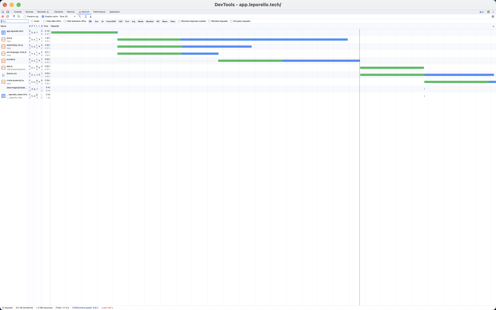

# You Don't Need Bundling to Speed Up Your Website: Leveraging Module Preloading

_8th January 2024_

## Native Loading of ES6 Modules by Browsers

Today, I aimed to enhance the initial loading speed of the [Leporello.js app](https://app.leporello.tech/).

Leporello.js employs ES6 modules without any build steps - the entire content of the repository is uploaded directly to Github Pages. It's straightforward! However, this approach might impede the app's initial loading speed.

Typically, an application features a root module, often named `index.js`, acting as the entry point. We include this module in our `index.html` using the `script` tag:

```html
<script type='module' src='index.js'></script>
```

`index.js` imports various other modules:

```javascript
import * as Foo from 'foo.js';
import * as Bar from 'bar.js';
import * as Baz from 'baz.js';
```

However, a challenge arises here. The browser lacks prior knowledge that `index.js` will import `foo.js`, `bar.js`, and `baz.js` until it downloads and parses `index.js`. Consequently, concurrent downloading of `index.js`, `foo.js`, and `bar.js` isn't feasible. Additionally, `foo.js` confronts a similar predicament, as it also imports other modules that cannot be downloaded until `foo.js` is parsed.

Until recently, bundlers were the primary solution. Bundlers concatenate multiple ES6 modules into a single file. Yet, bundlers introduce several drawbacks:

- They significantly complicate the build process.
- Debugging becomes more challenging as error stack traces now point to various locations within a single extensive bundle file.

## Module Preloading: A Solution Emerges!

Thankfully, over the past year, [all major browsers](https://caniuse.com/link-rel-modulepreload) have begun supporting an alternative to accelerate website load times: module preloading.

How does it function? By adding the following line to your `index.html`:

```html
<link rel="modulepreload" href="foo.js" />
```

This informs the browser that our website will utilize a module with the source 'foo.js.' Hence, the browser can speed up loading by fetching the file in advance. A simple build step can generate the `link rel=modulepreload` tag for each module in our `src` directory.

I created a basic bash script that operates without dependencies:

```bash
PRELOADS=""
for f in `find src -name '*.js'`; do
  PRELOADS=$PRELOADS"<link rel='modulepreload' href='/$f'>"
done

sed -i "s#.*PRELOADS_PLACEHOLDER.*#$PRELOADS#" index.html
```

This script lists all `.js` files in the `src` directory, generates a `link` tag for each file, and inserts the resulting text into `index.html`, replacing a designated placeholder - a simple HTML comment containing the text `PRELOADS_PLACEHOLDER`:

```html
<!--PRELOADS_PLACEHOLDER-->
```

Voila!

## Benchmarking

Now, let's turn to benchmarking.

Initially, I benchmarked the version without module preloading and bundling.

Using Github Pages as hosting and Chrome Dev Tools with network throttling (Slow 3G) enabled, the app loaded in __17.3 seconds__.

Refer to the waterfall chart:


The chart showcases a ladder-shaped pattern, a symptom elucidated earlier.

Upon introducing module preloading, the app loaded in __10.6 seconds__ -a  substantial acceleration!

The subsequent waterfall chart reveals a distinct pattern - no longer a ladder, but a flat list. All modules download simultaneously:


Let's compare module preloading to bundling. Bundling modules with [Rollup](https://rollupjs.org/) yielded a result of __9.8 seconds__. A minor improvement over module preloading.

The waterfall chart notably shrinks, now displaying one substantial bundle file as opposed to numerous small, separate module files:



## Conclusion

As an advocate of the [nobuild](https://world.hey.com/dhh/you-can-t-get-faster-than-no-build-7a44131c) approach, I'm enthused about module preloading. Coupled with [import maps](https://developer.mozilla.org/en-US/docs/Web/HTML/Element/script/type/importmap), they facilitate the development and publication of JS apps without convoluted toolchains.
