# Teach Programming and Algorithms More Effectively with Leporello.js

[Andrey Yershov](https://en.wikipedia.org/wiki/Andrey_Yershov), one of the pioneers in programming languages research, formulated the following thesis in the early 80s: [programming is the second literacy](https://www.sciencedirect.com/science/article/abs/pii/0165607481900028). According to Yershov's idea, in the future, only system programmers will professionally engage in programming, and there will be no need for application programmers at all - everyone will be able to program. Programming will become as ubiquitous a skill as reading and writing. Over 40 years later, we have not come closer to Yershov's vision. Programming remains as rare a skill as literacy in the Middle Ages.

I believe that learning programming can be significantly simplified by using more convenient and functional development environments. As such an environment, I propose [Leporello.js](https://leporello.tech). Here are the reasons why Leporello.js can simplify programming education.

## Ease of Install and Setup

The most challenging part of learning anything is getting started. Therefore, the beginning should be as easy and fast as possible. A student should write their first line of code as quickly as possible. We should not require them to separately install a compiler/interpreter for the programming language, set up the PATH, edit code in a text editor, compile, and run it in the terminal. All of these combined create a very high entry barrier.

Environments for learning programming should be integrated - the text editor, compiler, and debugger should be part of a single application. The programming environment can be a web application and not require installation and configuration.

## Interactivity

Conventional development environments lack interactivity. A student sees a text editor where they can write code, but they don't receive information from the editor about how their code is executed. At best, the student gets interactive information from the compiler about types. But that's not enough. With type information, a student might learn that a variable contains a number, for example. However, it would be much better if the student could see the actual number.

In spreadsheets, we simply edit data or formulas and see the result:

<video src="./media/excel.mov" controls></video>

In conventional development environments, just to find out the value of an arithmetic expression, you have to print it. This immediately introduces a huge conceptual burden for the student. We have to explain what functions are. We have to show their syntax. We have to explain to the student that calling a function for debugging printing outputs results to the terminal. There is no direct link between the line in the terminal and the function call. For example, we cannot click on the line and go to the function call.

Some environments provide a REPL (read-eval-print-loop). However, REPL environments have their drawbacks. A REPL is a new, additional UI, in addition to the text editor. It is much more convenient and understandable for the student to have one document with code open in a text editor, rather than fragmented pieces of code lost in the REPL history.

In Leporello.js, to see the value of an expression, you just need to place the cursor on it or highlight it. The value will be displayed on the right:

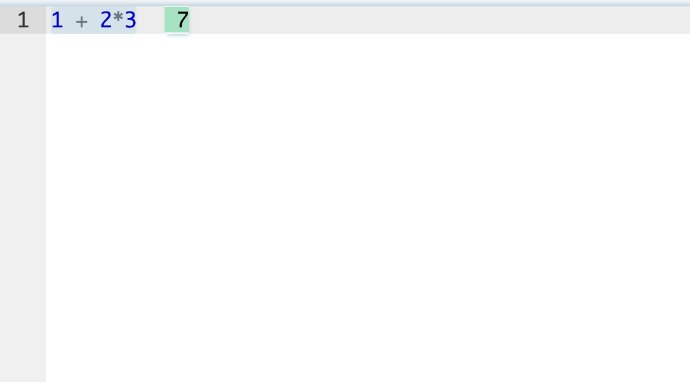

Expressions are evaluated as you type:

<video src="./media/eval_as_you_type.mov" controls></video>

Thus, Leporello.js can be used as a calculator.

__Without knowing anything about programming, without studying programming languages and tools, the student gets a useful tool that they can apply in their real life.__

Suppose a student needs to perform some arithmetic calculations. They open Leporello.js and use it as a calculator (I borrowed this example from the excellent application [Notepad Calculator](https://notepadcalculator.com/)):

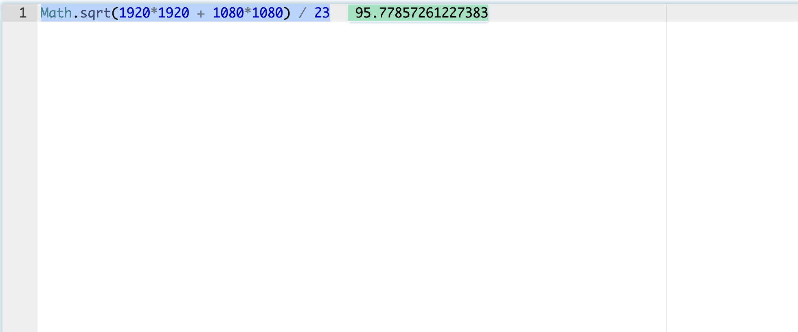

The student immediately experiences positive emotions. They acquire a useful and convenient tool. This removes the fear of something new, unclear, and unknown. Then it will be easy for them to gradually dive into programming concepts. For example, on the next step, they can give names to variables and add comments:

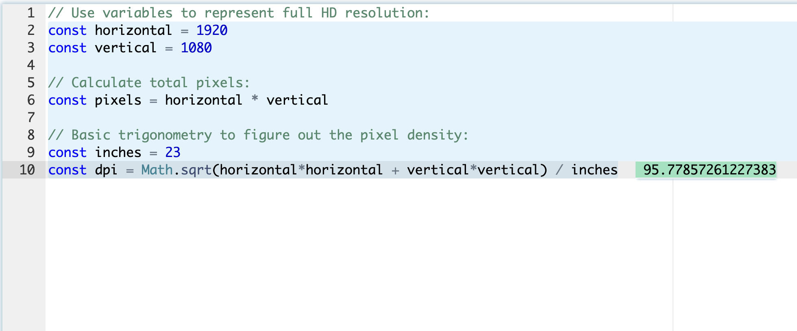

Later, they can declare a function to square a number, saving on retyping the identifier:

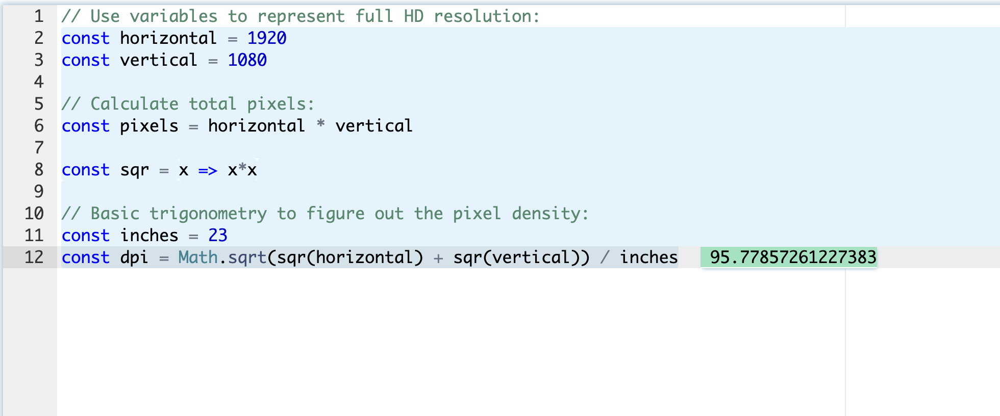

Thus, they naturally become acquainted with functions and the substitution model.

__The student gets the feeling that programming is a simple, natural activity. Writing a program is not a big deal.__

__Here, we get the convenience of Excel, but we have a direct path to migrate to real programming.__

In conventional environments, the editor is unfriendly. You can write code, but you cannot interact with it. It is not interactive, but static. In Leporello.js, the editor is interactive. You can click on any line and see what is happening:

<video src="./media/editor_interactive.mov" controls></video>

You can try this example yourself [here](https://app.leporello.tech/?share_id=44ca17dd459be340138a3165dc4c59669a4d5413).

## Interactive Debugging

The only interactive tool provided by conventional environments is an interactive debugger.

One of the most crucial skills for a programmer is the ability to simulate the execution of a program mentally. Learning programming largely involves training this skill. To teach the student this skill, we must provide tools that assist them until they master it, just as training wheels help a beginner cyclist:

What's wrong with conventional debuggers?

- We have two modes - the mode in which we write code and the mode in which we debug.

As known, modes in UI are bad. In Leporello.js, there is only one mode - in this mode, we simultaneously write code and debug. The debugger is always present, at any moment and in any line of code. There's no need to specially enable or launch it. Just place the cursor on any line of code or highlight an expression.

- Control is complex and non-intuitive.

Debugger control is done with a few small buttons (Step Into, Step Over, Step Out), the semantics of which require separate learning:

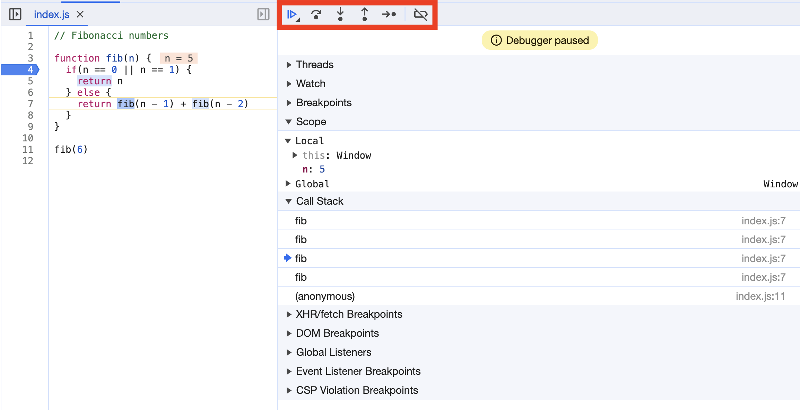

Debugger control buttons highlighted in red

If you accidentally press the wrong button, you might miss the function call you need. You can't go back. You have to restart the program and start debugging from the beginning. Thus, you have the possibility of performing an irreversible action. Why, in 2024, are we using UI with irreversible actions? No regular user would agree to work with such UI!

Imagine having to find a file in a complex folder tree. You can't freely click on folders in any order. Instead, the file manager shows you one folder after another, asking each time whether you want to enter the folder or skip it and move on to the next one. Such a file manager would be absurdly bad! Nevertheless, this is the UX that conventional debuggers offer us!

Conventional debuggers provide a call stack view where you can see the current call stack. You can even click on call stack elements:

<video src="./media/debugger_nav.mov" controls></video>

But effectively, you don't go back in time. You can only move through the process of program execution using the aforementioned buttons and only forward.

With the call stack view, we see which functions are currently executing. But we don't see which functions were executed before and which will be executed after. Imagine that instead of a **call stack**, the debugger showed us the complete **call tree**, as Leporello.js does:

<video src="./media/calltree.mov" controls></video>

You can try this example [online](https://app.leporello.tech/?example=fibonacci).

In Leporello.js, the only interface to the debugger is point&click! By clicking on elements in the call tree and moving through lines of code in the editor, we travel through time, moving forward and backward through the program's execution. At the same time, the values of mutable objects also roll back into the past!

Another issue with conventional debuggers is that they are not integrated with debug printing. The student may be confused about how to debug programs correctly - using debug printing or an interactive debugger. Heated debates on this topic can be found on discussion forums. Leporello.js integrates debug printing and interactive debugging. Clicking on a line in debug printing takes us to the interactive debugger:

<video src="./media/logs.mov" controls></video>

## Minimalism

Learning environments should have a minimalist UI. If the learning environment has a complex UI, the student's eyes wander. It seems to him that he has found himself in an unfamiliar and incomprehensible environment.

As noted earlier, in Leporello.js, the main UI is just mouse clicks - the simplest and most intuitive UI ever created.

Another UI is text selection. Anyone who has used a text editor is familiar with this UI. To see the value of an expression, simply select the text:

<video src="./media/selection.mov" controls></video>

Leporello.js overloads familiar operations in the text editor to provide additional information to the user, aside from their direct purpose.

## Visual Cues

Color allows conveying information. In conventional environments, color conveys only static information from the parser - different types of tokens are colored differently. Why not convey dynamic information about program execution? With color, we can convey which statements and expressions were executed and which were not. Statements and expressions that were computed have a blue background. Expressions that were not computed have a white background:

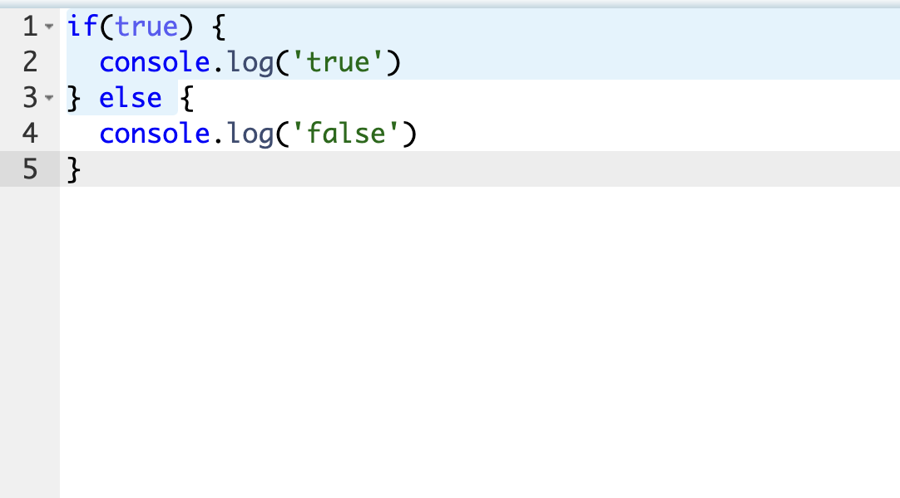

With Leporello.js, the student can easily understand how logical expressions are evaluated and how short-circuiting works:

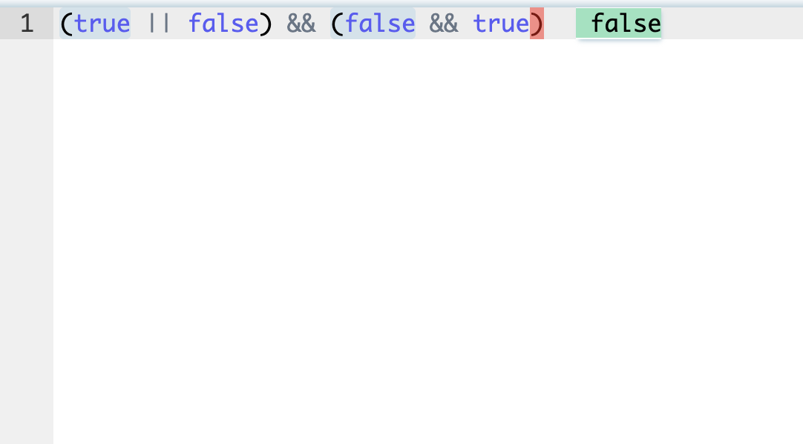

## High-level Overview of Program Execution

Conventional development environments do not provide any high-level representation of how a program is executed. The debugger is oriented towards displaying the current state of the program and allows moving through states in tiny steps.

Debugging a program becomes akin to navigating a path in a vast maze:

Function calls are rooms in this maze. You can only move forward (because the debugger does not allow moving backward). You remember which rooms you have recently visited (you have a call stack view), but you can't look ahead.

Imagine having an interactive map of the maze where you can see all the rooms. Your current position is marked on the map. You can instantly move to any room in the maze. With such a map, you can easily explore the maze:

Leporello.js provides the student with such a map in the form of a call tree view. With this map, the student can visually see how their program is executed, without the need to simulate execution in their mind.

Consider, for example, the [coin change problem](https://mitp-content-server.mit.edu/books/content/sectbyfn/books_pres_0/6515/sicp.zip/full-text/book/book-Z-H-11.html#%_idx_728) from the book "Structure and Interpretation of Computer Programs." Here is the [solution to this problem in Leporello.js](https://app.leporello.tech/?share_id=264e96a50f7ad8d762228e6ebd99e7ec010e25aa):

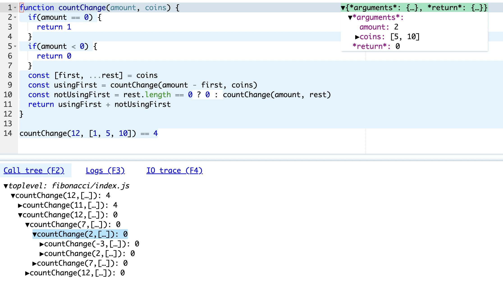

We can see how Leporello.js vividly visualizes the solution to the problem. We visually see how the original problem is broken down into two simpler problems, and this process repeats until the problems are reduced to trivial ones.

With such a scheme, the student can, for example, quickly understand how divide-and-conquer algorithms or recursive functions work. Visual interactive representations make these abstract concepts more tangible and help students build a strong foundation.

The mentioned book "Structure and Interpretation of Computer Programs" provides such a diagram to visualize the algorithm for computing Fibonacci numbers:

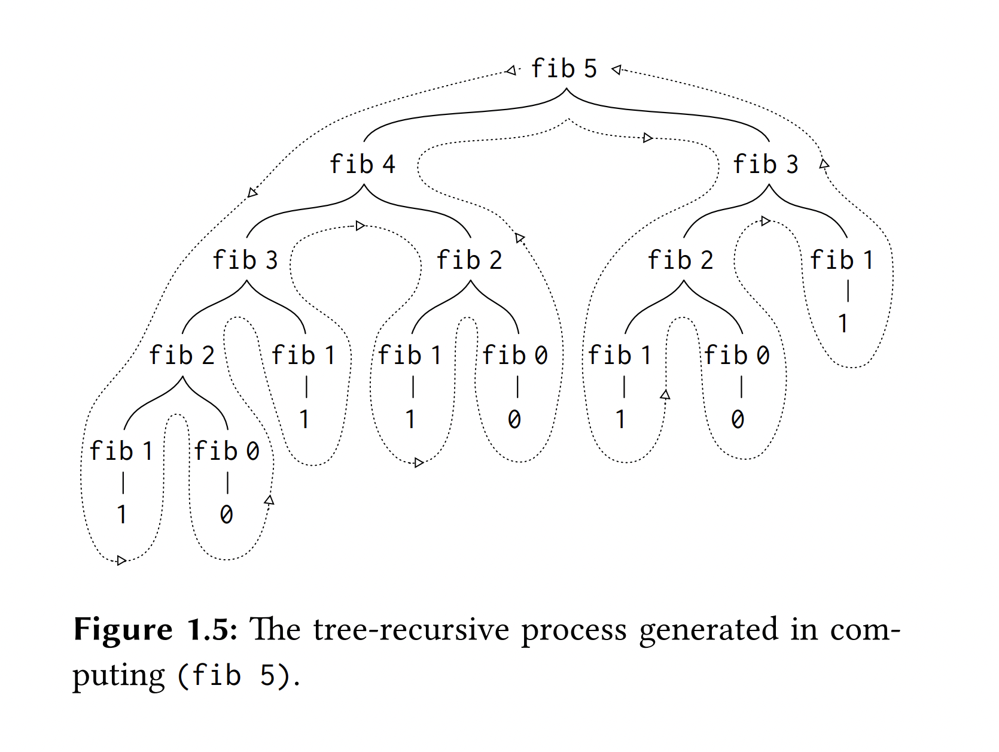

Leporello.js generates such a diagram for any program. Moreover, in Leporello.js, this diagram is interactive - you can click on any part of it and jump to the corresponding function call.

## Time Travel Debugging

To understand how a program was executed, the student needs to simulate in their mind through which states it passed - which functions were called, with which arguments, and what values they returned. Without time-travel tools, a programmer has to rely solely on their memory. For example, a programmer cannot go back and then forward again. They have to remember everything that happened until the current moment. Human memory is very limited. [As Andrey Yershov noted](https://softpanorama.org/Articles/Ershov/aesthetics_and_the_human_factor_in_programming_ershov1972.shtml), _"A programmer's personal push-down stack must exceed the depth of 5-6 positions, which psychologists have discovered to characterize the average man, his stack must be as deep as is needed for the problem which faces him, plus at least 2-3 positions deeper."_

The only time-travel tool provided by conventional environments is debug printing. Moving up and down debug printing, the programmer sees the execution history of the program. Unfortunately, as mentioned earlier, debug printing is a non-interactive tool. In conventional development environments, debug printing is not integrated with the interactive debugger.

Leporello.js provides a user interface for time travel in the form of the call tree view. By moving through call tree view elements, the programmer can see which functions were called, with which arguments, and what values they returned. Clicking on any element in the call tree, we travel in time to the moment of executing the selected function.

## Dealing with Mutable Data

In imperative programming, the program executes in a changing environment. To simulate the execution of a program in the mind, a programmer needs to remember the values of mutable objects and how they changed over time. If our programming environment does not provide us with tools for time-travel, the programmer can only survey one current state. To obtain past states, they can only rely on their memory.

Conventional development tools do not provide tools for working with mutable data. They allow you to see only one value at a time in the debugger. We cannot track how this value changed. The only way to find out how the value changed over time is to print it in debug printing. But, as noted earlier, debug printing and the debugger are parallel tools. They are not integrated with each other.

Leporello.js contains a [real-time travel engine](/blog/mutable_data/):

<video src="./media/mutability_1.nosound.mov" controls>
<pre>
  const array = [3,2,1]

  array.push(4)

  array[0] = 5

  array.sort()
</pre>
</video>

It allows moving through the call tree of the program and through the statements inside the function call, observing the values of objects at the time of executing the selected call or statement. Thus, the student can visually see how data changes during program execution. For example, they can visually see what the value of an object was before the call of a procedure that changed it and after the call.

## Bottom-Up Approach and Feedback Loop

Students stay engaged longer and learn faster when they receive quick feedback.

Except for compiler error information, conventional development environments provide little feedback. They leave the student alone, requiring them to think through and write a correct program from the first attempt. Instead, it's much easier and more natural to write a program by taking small steps and visualizing the results of each step. This way, the student can continuously receive positive reinforcement, helping them stay engaged and motivated.

Let's look at how a student can implement a sorting function in Leporello.js, creating code line by line and getting results after each line. Suppose they know the general idea of the algorithm and need to write the implementation. They start by creating a test array and writing the function header:

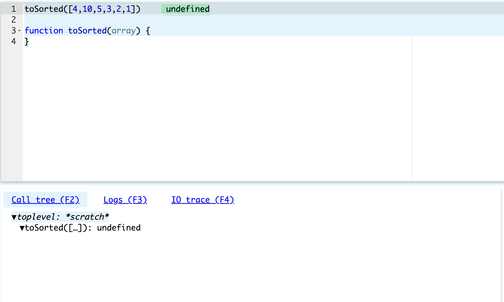

They see that their function returned `undefined` (in JavaScript, if there is no `return` in a function, it implicitly returns `undefined`).

Then, they add code that destructures the array, extracting the first value and the rest:

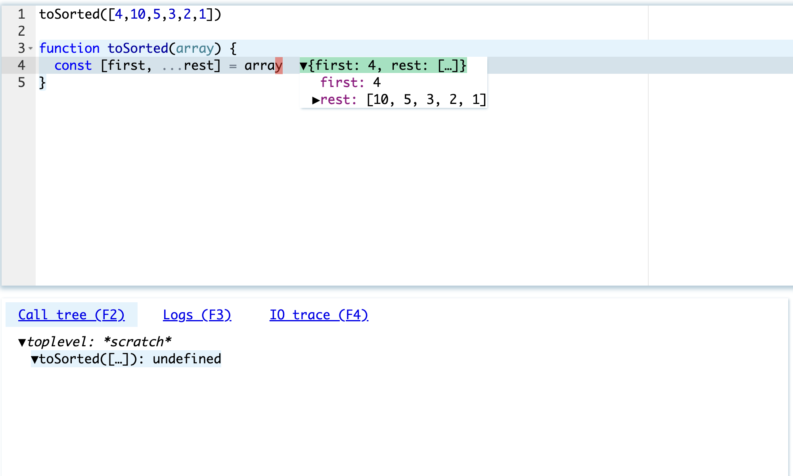

This is a simple operation. But the student visually sees that it was executed correctly. This gives them confidence to move on.

Next, they extract the elements that should come before the `first` element:

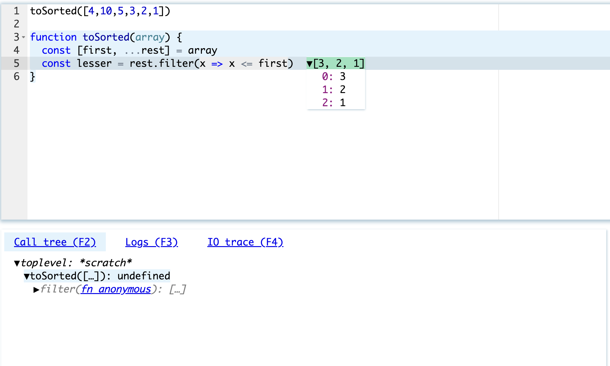

and after the `first` element:

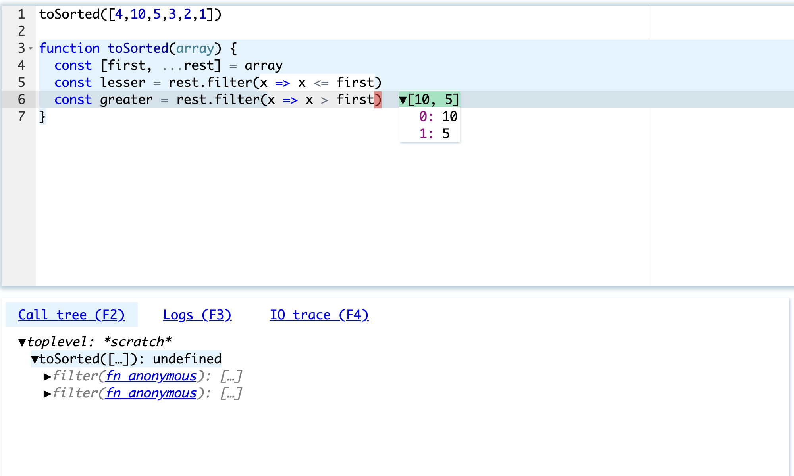

Now they can concatenate the obtained arrays. The first element is in its correct place.

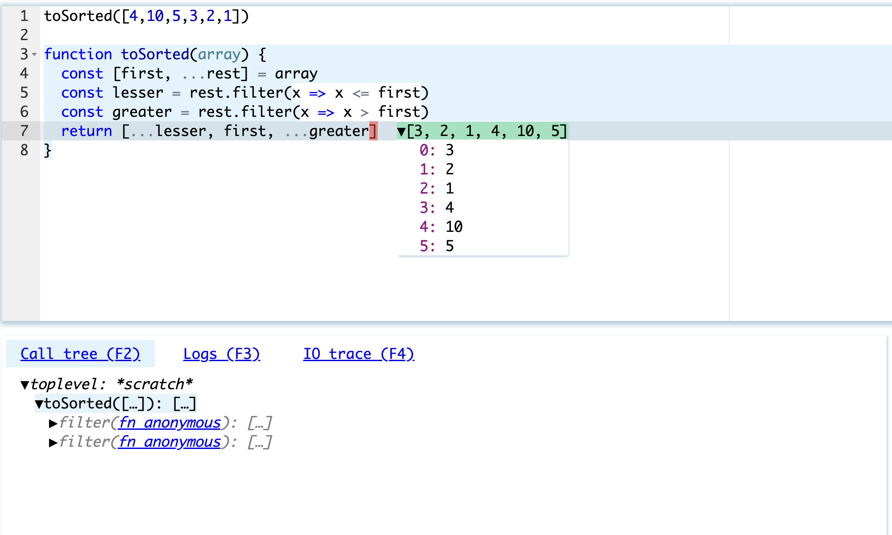

Now, sort the left and right arrays. They sort the left array and get an error:

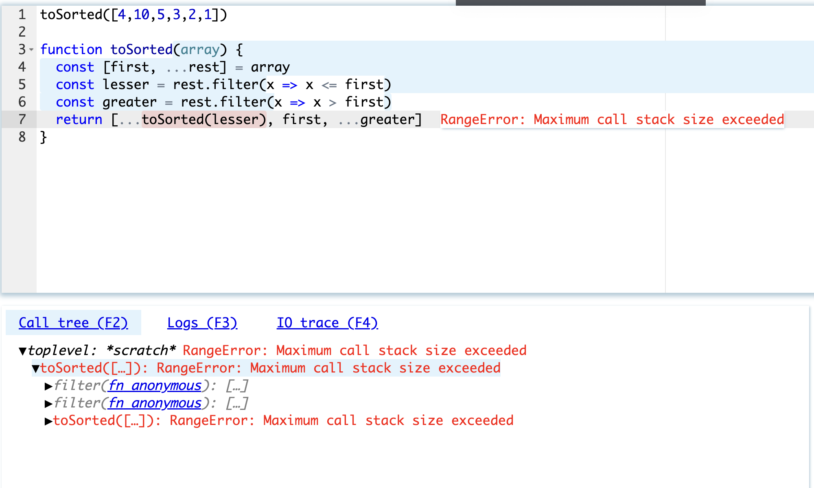

They delve into the call tree and see that the `toSorted` function calls itself indefinitely, taking an empty array as an argument:

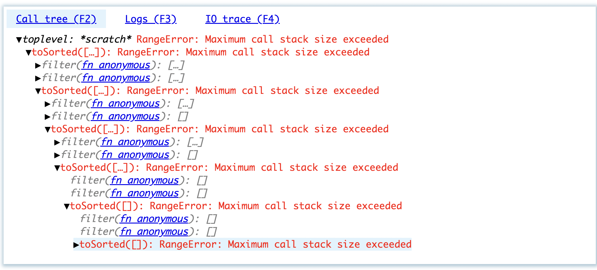

They add a non-recursive branch and get the correct answer:

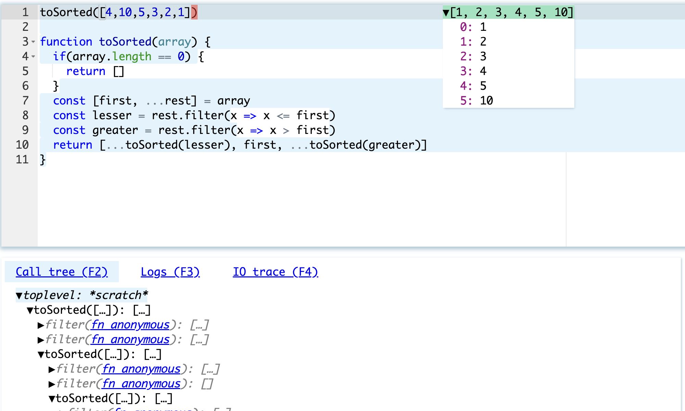

Thus, we see that Leporello.js allows writing a program incrementally, line by line, at each step receiving feedback. Importantly, the student doesn't need to learn any complex UI. Leporello.js is always there, showing them how their code is executing and what is happening.

## Pain We Forgot

Jamie Brandon, in his excellent essay ["Pain we forgot"](http://lighttable.com/2014/05/16/pain-we-forgot/), made a profound observation:

_Much of the pain in programming is taken for granted. After years of repetition it fades into the background and is forgotten. The first step in making programming easier is to be conscious of what makes it hard._

In the process of learning programming, the future programmer must learn to simulate the execution of code in their mind, holding the changing context in which this code is executed. This is a very difficult task. If we provide students with the right tools, we can make this task easier and make programming education less painful.
