# Teach Programming and Algorithms More Effectively with Leporello.js

[Andrey Yershov](https://en.wikipedia.org/wiki/Andrey_Yershov), один из пионеров programming languages research, в начале 80-x сформулировал следующий тезис: [программирование - это вторая грамотность](https://www.sciencedirect.com/science/article/abs/pii/0165607481900028). По мысли Ершова, в будущем профессионально заниматься программированием будут только системные программисты, а прикладных программистов не останется вообще - программировать будет уметь каждый. Программирование станет таким же повсеместным умением, как чтение и письмо. Спустя более 40 лет, мы так и не приблизились к видению Ершова. Программирование остается таким же редким навыком, как грамотность в средние века.

Я верю, что изучение программирования можно значительно упростить, если использовать более удобные и функциональные среды разработки. В качестве такой среды я предлагаю [Leporello.js](https://leporello.tech). Вот причины, по которым Leporello.js позволяет упростить обучение программированию.

## Ease of install and setup

Самое сложное в обучении чему-либо - это начать. Поэтому начало должно быть максимально легким и быстрым. Студент должен написать свою первую строку кода как можно быстрее. Мы не должны требовать от него установить отдельно компилятор/интерпретатор языка программирования, настроить PATH, отредактировать код в текстовом редакторе, скомпилировать и запустить его в терминале. Все перечисленное вместе составляет очень высокий порог вхождения.

Среды для обучения программированию должны быть интегрированными - текстовый редактор, компилятор и отладчик должны быть одним приложением. Среда для программирования может быть веб-приложением и вообще не требовать установки и настройки.

## Interactivity

Общепринятым средствам разработки не хватает интерактивности. Студент видит перед собой текстовый редактор, в котором он может писать код. Но он не получает от редактора информации о том, как его код выполняется. В лучшем случае, студент получает интерактивную информацию от компилятора о типах. Но этого недостаточно. С информацией о типах, студент может узнать например, что переменная содержит число. Но намного лучше будет, если студент увидит само это число.

В электронных таблицах мы просто редактируем данные или формулы и видим результат:

<video src="./media/excel.mov" controls></video>

В конвенциональных средах разработки, чтобы просто узнать значение арифметического выражения, надо вывести его на печать. Это сразу порождает огромную концептуальную нагрузку для студента. Мы должны объяснить ему, что такое функции. Нам надо показать их синтаксис. Нам надо объяснять студенту, что вызов функции для отладочной печати выводит результаты в терминал. При этом отсутствует прямая связь между строчкой в терминале и вызовом функции для вывода на печать. Например, мы не можем кликнуть на строчку, и перейти к вызову функции.

Некоторые среды предоставляют REPL (read-eval-print-loop). Однакo у REPL-сред есть свои недостатки. REPL - это новый, дополнительный UI, помимо текстового редактора. Намного удобнее и понятнее для студента иметь один документ с кодом, открытый в текстовом редакторе, вместо обрывочных кусочков кода, теряющихся в истории репла.

В Leporello.js, чтобы увидеть значение выражения, достаточно поставить на него курсор или выделить его. Значение будет отображено справа:

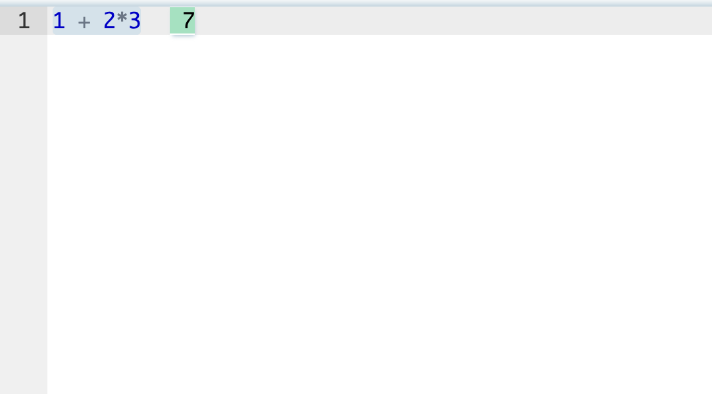

Выражения вычисляются по мере того как вы печатаете:

<video src="./media/eval_as_you_type.mov" controls></video>

Таким образом, Leporello.js можно использовать как калькулятор.

__Не зная ничего о программировании, не изучая языки программирования и инструменты для программирования, студент получает полезный инструмент, который он может применять в своей реальной жизни__

Допустим, студенту нужно провести какие-то арифметические вычисления. Он открывает Leporello.js и использует его как калькулятор (я заимствовал этот пример из отличного приложения [Notepad Calculator](https://notepadcalculator.com/):

Студент сразу испытывает положительные эмоции. Он овладевает полезным удобным инструментом. Это убирает страх перед новым, непонятным и неизвестным. Дальше ему будет легко постепенно погружаться, осваивая концепции программирования. Например, на следующем шаге он может дать имена переменным и добавить комментарии:

В дальнейшем он может объявить функцию для возведения числа в квадрат, чтобы сэкономить на перепечатывании индентификатора:

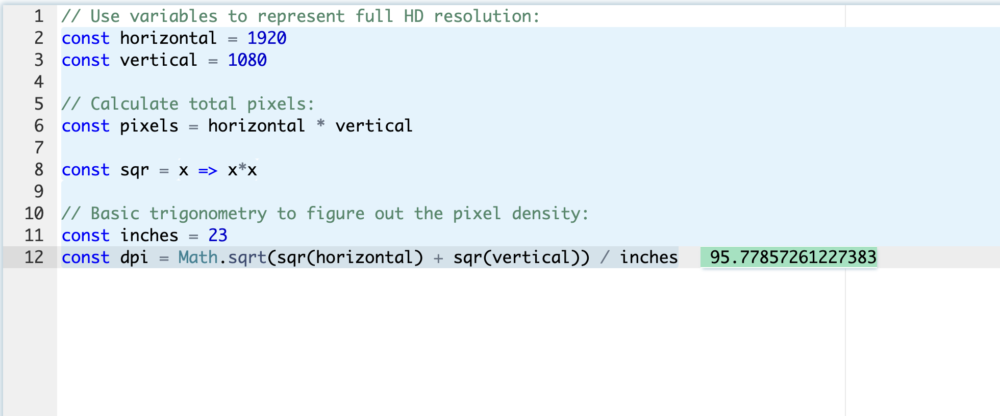

Таким образом, он естественным образом знакомится с функциями и substitution model.

__У студента создается ощущение, что программирование - это простая естественная деятельность. Написание программы - not a big deal.__

__Мы тут получаем удобство Excel, но при этом у нас есть прямой путь миграции в реальное программирование.__

В общепринятых средах редактор недружественный. Вы можете писать код, но вы не можете взаимодействовать с ним. Он не интерактивный, а статичный. В Leporello.js, редактор интерактивный. Вы можете кликнуть на любую строку и увидеть, что там происходит:

<video src="./media/editor_interactive.mov" controls></video>

Вы можете попробовать этот пример сами [тут](https://app.leporello.tech/?share_id=44ca17dd459be340138a3165dc4c59669a4d5413).

## Interactive debugging

Единственный интерактивный инструмент который предоставляют общепринятые среды - это интерактивный дебаггер.

Один из важнейших навыков программиста - это умение симулировать выполнение программы в уме. Обучение программированию в значительнойй степени заключается в тренировке этого навыка. Чтобы студент обучился этому навыку, мы должны ему предоставить инструменты, которые будут ему помогать, пока он не овладел этим навыком, так же как training wheels помогают начинающему велосипедисту:

Что не так с конвенциональными дебаггерами?

- У нас есть два режима - режим в котором мы пишем код, и режим в котором мы отлаживаем.

Как известно, modes in UI are bad. В Leporello.js у нас есть только один режим - в этом режиме мы одновременно пишем код и отлаживаем. Дебаггер присутствует всегда, в любой момент времени и в любой строчке кода. Его не надо как-то специально включать или запускать. Достаточно поставить курсор на любую строку кода или выделить выражение.

- Управление сложно и неинтуитивно

Управление дебаггером производится несколькими маленькими кнопками (Step Into, Step Over, Step Out), семантика которых требует отдельного изучения:

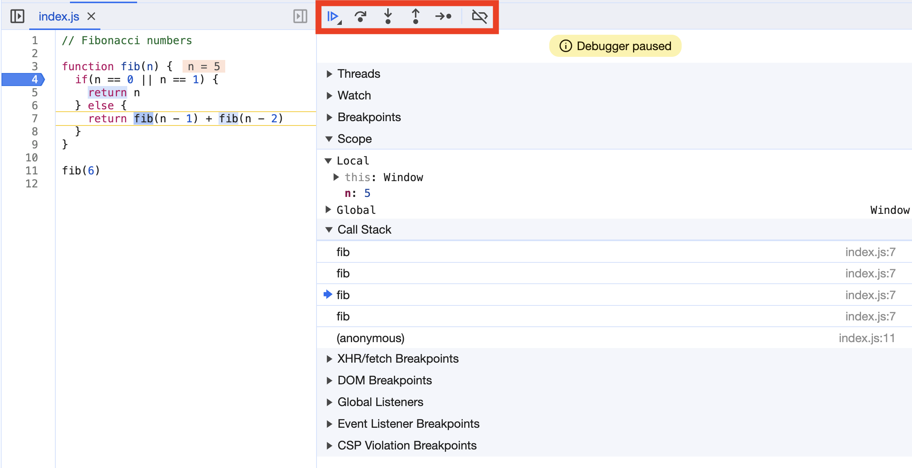

Кнопки управления дебаггером выделены красным

Если вы случайно нажали не на ту кнопку, то вы могли пропустить нужный вам вызов функции. Вы не можете вернуться назад. Придется перезапускать программу и начинать дебаггинг сначала. Таким образом, у вас есть возможность сделать неотменяемое действие. Почему в 2024 году мы пользуемся UI с неотменяемыми действиями? Никто бы из обычных пользователей не согласился бы работать с таким UI!

Представьте себе, что вам надо найти файл в сложном дереве папок. Вы не можете свободно кликать по папкам в произвольном порядке. Вместо этого, файловый менеджер показывает вам папку за папкой, предлагая каждый раз выбрать, хотите ли вы зайти внутрь папки, или вы хотите ее пропустить и перейти к следующей папке. Такой файловый менеджер был бы абсурдно плох! Тем не менее, это именно тот UX, который нам предлагают конвенциональный дебаггеры!

Конвенциональные дебаггеры предоставляют call stack view, где вы можете видеть текущий колстэк. Вы даже можете нажимать на элементы колстэка:

<video src="./media/debugger_nav.mov" controls></video>

Но фактически вы при этом не переноситесь назад во времени. Вы можете перемещаться по процессу выполнения программы только с помощью вышеупомянутых кнопок, и только вперед.

С помощью call stack view, мы видим какие функции исполняются сейчас. Но мы не видим, какие функции выполнялись до, и какие будут выполняться после. Представьте себе, что вместо __стэка вызовов__, дебаггер показывал бы нам полное __дерево вызовов__, как это делает Leporello.js:

<video src="./media/calltree.mov" controls></video>

Вы можете попробовать этот пример [онлайн](https://app.leporello.tech/?example=fibonacci).

В Leporello.js единственный интерфейс к дебаггеру - это point&click! Кликая по элементам в дереве вызов, и перемещаясь по строкам кода в редакторе, мы путешествуем во времени, перемещаясь вперед и назад по процессу выполнения программы. При этом значения мутабельных объектов также откатываются в прошлое!

Другая проблема с общепринятыми дебаггерами состоит в том, что они никак не интегрированы с отладочной печатью. У студента может возникнуть непонимание, как правильно отлаживать программы - с помощью отладочной печати, или с помощью интерактивного дебаггера. На дискуссионных форумах на этот счет идут жаркие дебаты. Leporello.js интегрирует отладочную печать и интерактивный дебаггинг. При нажатии на строчку в отладочной печати, мы перемещаемся в интерактивный дебаггер:

<video src="./media/logs.mov" controls></video>

## Minimalism

Среды для обучения должны обладать минималистичным UI. Если у среды обучения сложный UI, то у студента разбегаются глаза. Ему кажется, что он оказался погружен в незнакомую непонятную среду.

Как мы отметили ранее, в Leporello.js основной UI - это просто клики мышкой - наиболее простой и интуитивный UI из когда-либо созданных.

Другой UI - это выделение текста. C этим UI уже знаком любой, кто пользовался текстовым редактором. Для того чтобы посмотреть значение выражения, достаточно выделить текст:

<video src="./media/selection.mov" controls></video>

Leporello.js перегружает знакомые операции в текстовом редакторе, чтобы они помимо своего прямого назначения, давали дополнительную информацию пользователю.

## Visual cues

Цвет позволяет передавать информацию. В общепринятых средах цвет передает только статическую информацию от парсера - разные типы токенов раскрашены в разные цвета. Почему бы не передавать динамическую информацию о выполнении программы? С помощью цвета мы можем передать, какие стейтменты и выражения выполнялись, а какие нет. У стейтментов и выражений, которые были вычислены, голубой бэкграунд. У выражений которые не были вычислены - белый:

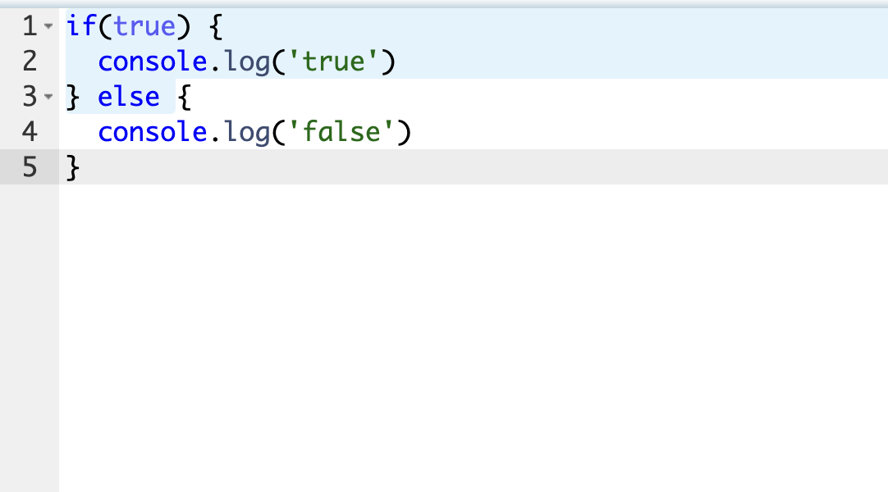

С помощью Leporello.js студенту легко понять, как вычисляются логические выражения и как работает short-circuiting:

## High-level overview of program execution

Конвенциональный среды разработки не дают никакого высокоуровневого представления о том, как выполняется программа. Дебаггер ориентирован на то, чтобы отобразить текущее состояние программы и позволяет перемещаться по состояниям крошечными шажками.

Отладка программы становится похожей на поиск пути в огромном лабиринте:

Вызовы функций - это комнаты в этом лабиринте. Вы можете двигаться только вперед (потому что дебаггер не позволяет двигаться назад). Вы помните, какие комнаты вы посещали недавно (у вас есть call stack view), но вы не можете заглянуть вперед.

Представьте, что у вас есть интерактивная карта лабиринта, на которой вы можете увидеть все комнаты. На карте отмечено ваше текущее положение. Вы можете мгновенно переместиться в любую комнату лабиринта. С такой картой вы сможете легко изучить лабиринт:

Leporello.js дает студенту такую карту лабиринта в виде call tree view. С помощью этой карты, студент может наглядно видеть, как выполняется его программа, без необходимости симулировать выполнение в уме.

Рассмотрим для примера [задачу о размене монет](https://mitp-content-server.mit.edu/books/content/sectbyfn/books_pres_0/6515/sicp.zip/full-text/book/book-Z-H-11.html#%_idx_728) из книги Structure and Interpretation of Computer Programs. Вот [решение этой задачи в Leporello.js](https://app.leporello.tech/?share_id=264e96a50f7ad8d762228e6ebd99e7ec010e25aa):

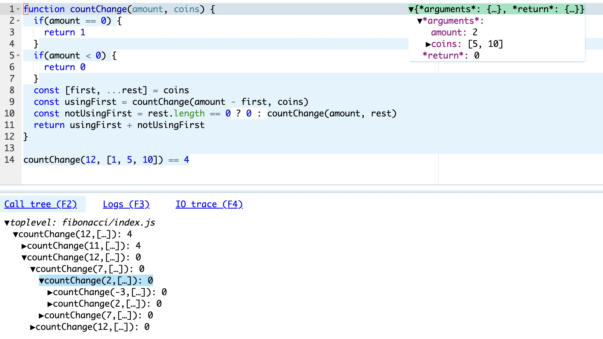

Мы видим, как Leporello.js наглядно визуализирует решение задачи. Мы наглядно видим, как исходная задача разбивается на две более простые задачи, и этот процесс повторяется, пока задачи не будут сведены к тривиальным.

С помощью такой схемы, студент может например быстрее понять, как работают divide-and-conquer алгоритмы или рекурсивные функции. Visual interactive representations make these abstract concepts more tangible and help students build a strong foundation.

Вышеупомянутая книга Structure and Interpretation of Computer Programs приводит такую диаграмму для визуализации алгоритма вычисления чисел Фибоначчи:

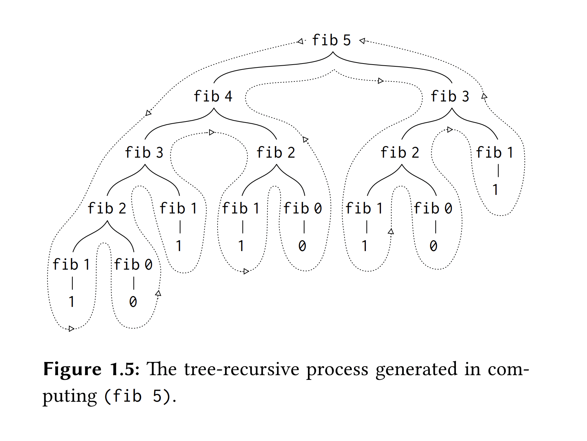

Leporello.js генерирует такую диаграмму для любой программы. Причем в Leporello.js эта диаграмма интерактивная - вы можете кликнуть в любое ее место и перенестись в соответствующий вызов функции.

## Time travel debugging

Для понимания, как исполнялась программа, студенту необходимо симулировать в уме, через какие состояния она проходила - какие функции вызывались, с какими аргументами, и какие значения они возвращали. Без инструментов для time-travel, программисту приходится рассчитывать только на свою память. Программист например не может вернуться назад, а потом снова перенестись вперед. Он должен помнить все, что происходило до текущего момента. Человеческая память очень ограничена. [Как заметил Andrey Yershov](https://softpanorama.org/Articles/Ershov/aesthetics_and_the_human_factor_in_programming_ershov1972.shtml), _"A programmer's personal push-down stack must exceed the depth of 5-6 positions, which psychologists have discovered to characterize the average man, his stack must be as deep as is needed for the problem which faces him, plus at least 2-3 positions deeper."_

Единственный инструмент для time-travel, который предоставляют обычные среды - это отладочная печать. Перемещаясь вверх и вниз по отладочной печать, программист видит историю исполнения программы. К сожалению, как мы указали раньше, отладочная печать - неинтерактивный инструмент. В обычных средах разработки отладочная печать никак не интегрирована с интерактивным дебаггером.

Leporello.js предоставляет пользовательский интерфейс для путешествия во времени в виде calltree view. Перемещаясь по элементам calltree view, программист может видеть, какие функции вызывались, с какими аргументами, какие значения они возвращали. Кликнув на любой элемент в дереве вызовов, мы переносимся во времени на момент выполнения выбранной функции.

## Dealing with mutable data

В императивном программировании программа исполняется в изменяющемся окружении. Чтобы симулировать выполнение программы в уме, программисту требуется помнить, какие были значения у мутабельных объектов и как они изменялись во времени. Если наша среда программирования не предоставляет нам инструментов для перемещения во времени, то программист может обозревать только одно текущее состояние. Для получения прошлых состояний, он может надеяться только на свою память.

Общепринятые средства разработки не предоставляют инструментов для работы с изменяемыми данными. Они дают возможность увидеть в дебаггере одно значение за раз. Мы не можем проследить, как менялось это значение. Единственный способ узнать, как менялась значение со временем - это вывести его на отладочную печать. Но как мы заметили раньше, отладочная печать и дебаггер - это параллельные инструменты. Они никак не интегрированы друг с другом.

Leporello.js содержит [настоящий time-travel движок](/blog/mutable_data/):

<video src="./media/mutability_1.nosound.mov" controls>
<pre>
  const array = [3,2,1]

  array.push(4)

  array[0] = 5

  array.sort()
</pre>
</video>

Он позволяет перемещаться по дереву вызовов программы и по стейтментам внутри вызова функции, обозревая значение объектов на момент выполнения выбранного вызова или стейтмента. Таким образом, студент может наглядно видеть, как данные изменяются в процессе выполнения программы.  Например, он может наглядно видеть, каким было значение объекта до вызова процедуры, которая его поменяла, и после вызова.

## Bottom up approach and feedback loop

Cтуденты дольше остаются вовлеченными и учатся быстрее, когда они быстро получают обратную связь.

За исключением информации об ошибках от компилятора, обычные среды разработки дают мало обратной связи. Они оставляют студента наедине с собой, требуя от него продумать и написать корректную программу с первого раза. Вместо этого, намного проще и естественнее писать программу, двигаясь небольшими шагами и визуализируя результаты каждого шага. Таким образом, студент может постоянно получать положительное подкрепление, что поможет оставаться ему вовлеченным и мотивированным.

Давайте рассмотрим, как студент может реализовать функцию сортировки в Leporello.js, создавая код строка за строкой, и получая результат после каждой строки. Допустим, он знает общую идею алгоритма, и ему требуется написать имплементацию. Он начинает с того что создает тестовый массив и пишет заголовок для функции:

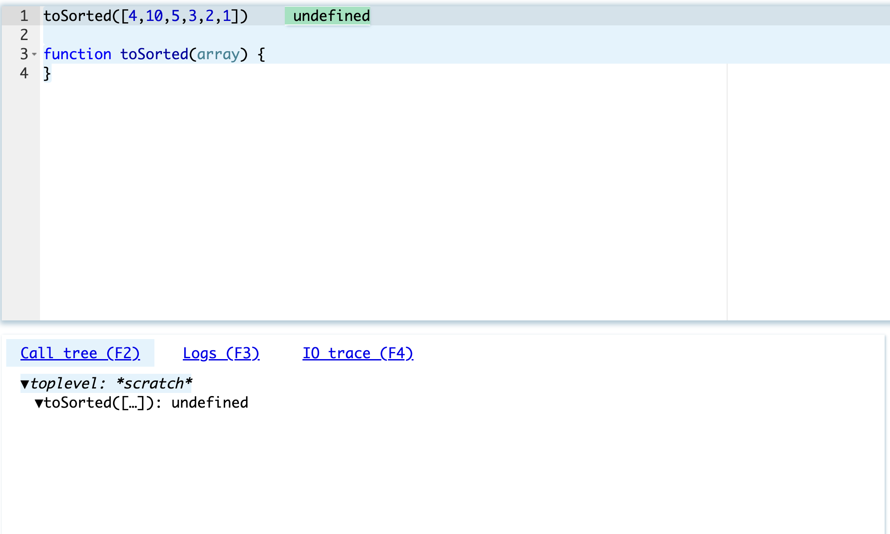

Он видит, что его функция вернула `undefined` (в JavaScript, если в функции нет `return`, то она неявно возвращает `undefined`)

Затем он добавляет код, который деструктурирует массив, выделяя из него первое значение и оставшиеся:

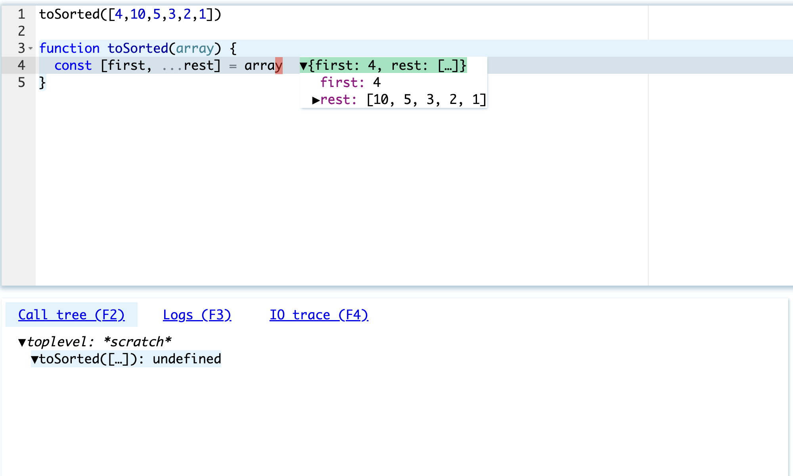

Это простая операция. Но студент наглядно видит, что она была выполнена корректно. Это придает ему уверенность, чтобы двигаться дальше.

Затем он вычленяет элементы, которые должны оказаться перед `first` элементом:

и после `first` элемента:

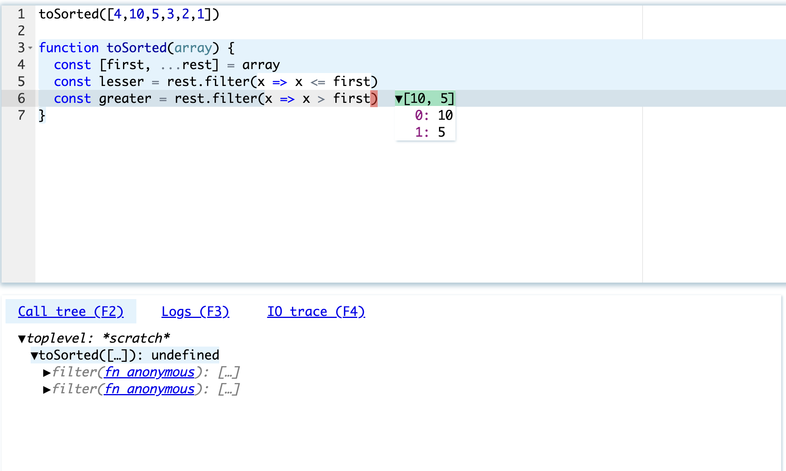

Теперь можно объединить полученные массивы. Первый элемент встал на свое правильное место. 

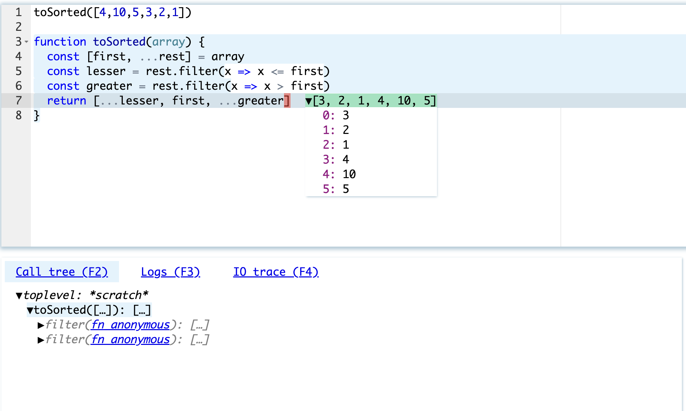

Осталось теперь отсортировать левый и правый массивы. Мы сортируем левый массив и получаем ошибку:

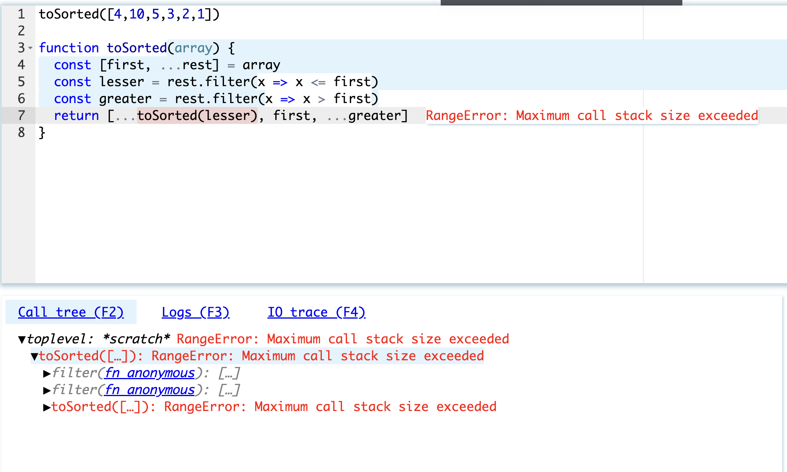

Мы углубляемся в дерево вызовов, и видим, что функция `toSorted` вызывает сама себя до бесконечности, получая в качестве аргумента пустой массив:

Мы добавляем нерекурсивную ветку и получаем правильный ответ:

Таким образом, мы видим, что Leporello.js позволяет писать программу инкрементально, строка за строкой, на каждом шаге получая фидбек. Что важно, студенту не нужно изучать никакой сложный UI. Leporello.js постоянно находится рядом с ним и показывает ему, как его код выполняется, и что происходит.

## Pain we forgot

Jamie Brandon в своем великолепном эссе [Pain we forgot](http://lighttable.com/2014/05/16/pain-we-forgot/) сделал глубокое наблюдение:

_Much of the pain in programming is taken for granted. After years of repetition it fades into the background and is forgotten. The first step in making programming easier is to be concious of what makes it hard._

В процессе обучения программированию, будущий программист должен научиться симулировать выполнение кода в уме, удерживая в голове меняющийся контекст в котором этот код выполняется. Это очень сложная задача. Если мы дадим студенту подходящие инструменты, мы сможем облегчить эту задачу и сделать обучение программированию менее болезнненым.

__Обновление:__ _Leporello.js теперь позволяет программировать и отлаживать [2d-графикy и анимацию](/blog/2d_graphics_and_animation_with_time_travel/), что является отличным материалом для обучения программированию_
