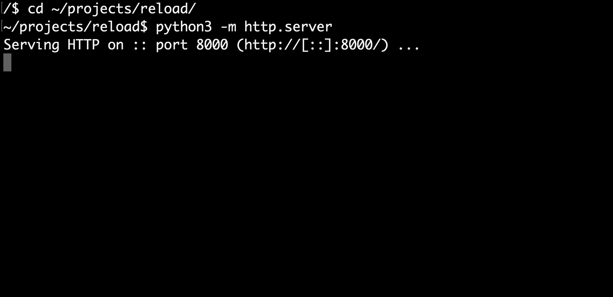
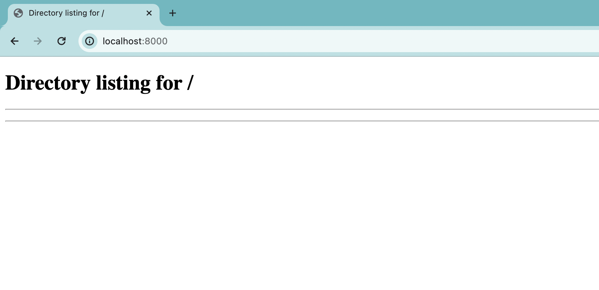

# You don't need Webpack for hot reload

Did you know that hot reloading is a built-in feature of the Google Chrome browser? You can edit code using a text editor, save it, and the changes are picked up by the browser __without reloading the page__. In other words, it works like Webpack HMR but is a built-in feature of Google Chrome and doesn't require installing any additional software!

On a short video, you can see how it works:

<video src='./media/demo.mov' controls></video>

## Setting up

Here are the instructions on how to set it up:

- Create an empty folder on your computer. In my case, the path to the folder is `~/projects/reload`.
- Start a web server on your computer that will serve the contents of the folder. I use the `http.server` module built into the Python programming language. To start this server, simply open the terminal, navigate to the folder using the `cd` command, and run the command:

```bash
python3 -m http.server
```

You should see the following result:



- Open Google Chrome and enter `http://localhost:8000/` in the address bar. You should see the following result:



- Create a file named `index.html` in the folder with the following content:

```html
<script type="module" src='index.js'></script>
```

and a file named `index.js` with the following content:

```javascript
import { h, render } from 'https://esm.sh/preact'
import { useState } from 'https://esm.sh/preact/hooks';
import htm from 'https://esm.sh/htm'

// Initialize htm with Preact
const html = htm.bind(h)

function Counter() {
  const [value, setValue] = useState(0)

  return html`
    <div>
      <div>Counter: ${value}</div>
      <button onClick=${() => setValue(value + 1)}>Increment</button>
      <button onClick=${() => setValue(value - 1)}>Decrement</button>
    </div>
  `
}

render(html`<${Counter}/>`, document.body)
```

- Refresh the page in Google Chrome, and now you should see a counter with buttons, similar to the video.

- Now the magic begins. Open Chrome Developer Tools and select the Sources tab, then the Workspace tab, and click the Add Folder button (highlighted in red):


- The Open File Dialog will appear. Select the folder you created at the beginning:


- Google Chrome will ask for confirmation. Click Allow:


Now everything is ready! Edit the code, save the file, and watch as Google Chrome picks up the modified code without reloading the page! It's important to keep Chrome Developer Tools open.

## What is this magic called?

This feature is called Live Edit. For some reason, it is not well-advertised. It is documented on the [Chrome Developer Tools](https://developer.chrome.com/docs/devtools/workspaces) website.

## CSS

This feature also works for CSS. Interestingly, it works both ways. When you edit styles in the Elements view, Chrome changes the file on the hard drive. For example, you can select a color using the color picker, and you don't have to manually copy the RGB code into your text editor. And vice versa, if you change styles in the editor, they are picked up by Chrome without reloading the page.

## [nobuild](https://world.hey.com/dhh/you-can-t-get-faster-than-no-build-7a44131c)

I have previously written about [module preloading](https://leporello.tech/blog/module_preload/).

Together with [import maps](https://developer.mozilla.org/en-US/docs/Web/HTML/Element/script/type/importmap), module preloads, and Live Edit, we can develop HTML5 applications without complex build tools!