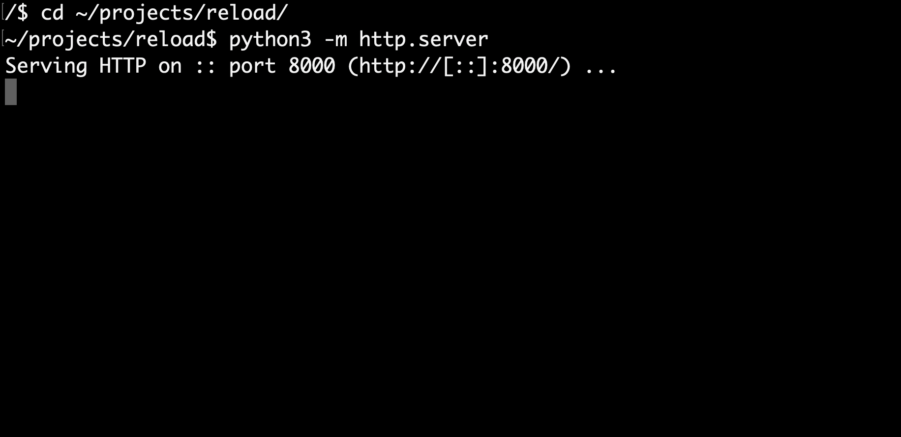
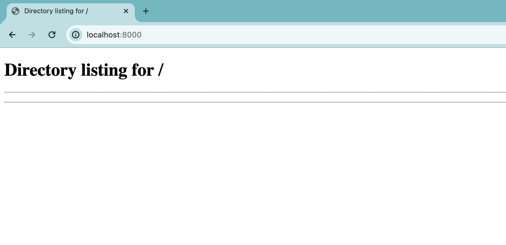
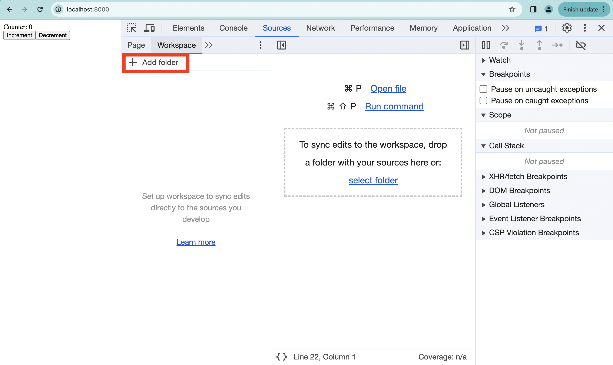
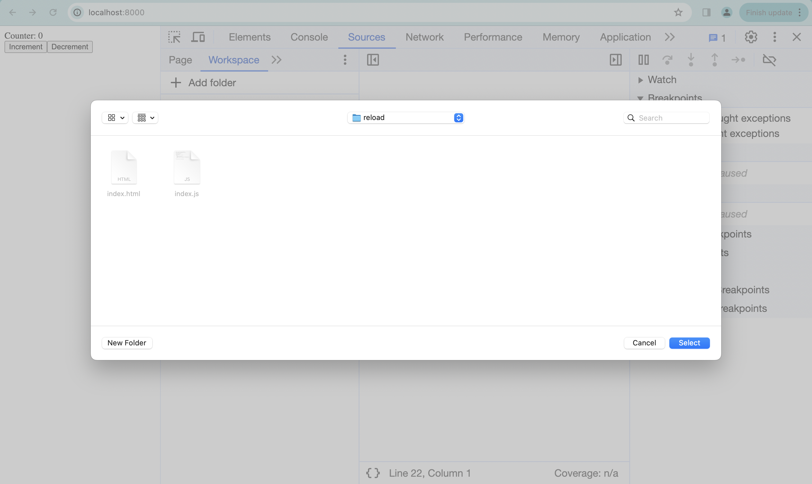
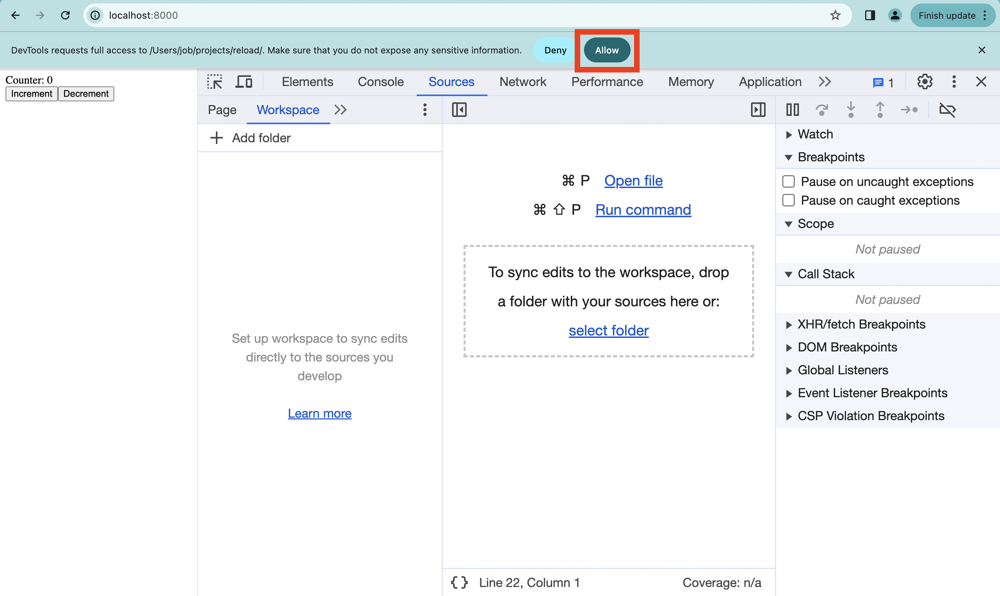

# You dont need Webpack for hot reload

Знаете ли вы, что горячая перезагрузка кода - встроенная фича браузера Google Chrome? Вы можете редактировать код с помощью текстового редактора, сохранять его, и изменения подхватываются браузером __без перезагрузки страницы__. Другими словами, это работает как Webpack HMR, но является встроенной возможностью Google Chrome и не требует установки никакого дополнительного софта!

На коротком видео вы можете видеть, как это работает:

<video src='./media/demo.mov' controls></video>

## Setting up

Вот инструкция, как это настроить:

- Создайте на своем комьютере пустую папку. В моем случае путь к папке - `~/projects/reload`
- Запустите на своем компьютере веб-сервер, который будет раздавать содержимое папки. Я использую модуль `http.server`, встроенный в язык программирования Python. Чтобы запустить этот сервер, достаточно открыть терминал, зайти в папку с помощью команды `cd`, и выполнить команду:

```
python3 -m http.server
```

Вы должны увидеть такой результат:



- Откройте Google Chrome и введите в адресной строке `http://localhost:8000/`. Вы должны увидеть такой результат:



- Создайте в папке файл `index.html` с таким содержимым:

```
<script type="module" src='index.js'></script>
```

и файл `index.js` с таким содержимым:

```
import { h, render } from 'https://esm.sh/preact'
import { useState } from 'https://esm.sh/preact/hooks';
import htm from 'https://esm.sh/htm'

// Initialize htm with Preact
const html = htm.bind(h)

function Counter() {
  const [value, setValue] = useState(0)

  return html`
    <div>
      <div>Counter: ${value}</div>
      <button onClick=${() => setValue(value + 1)}>Increment</button>
      <button onClick=${() => setValue(value - 1)}>Decrement</button>
    </div>
  `
}

render(html`<${Counter}/>`, document.body)
```

- Перезагрузите страницу в Google Chrome, и теперь вы должны увидеть счетчик с кнопками, такой же как в видео.

- Теперь начинается магия. Откройте Chrome Developer Tools и выберите вкладку Sources, затем вкладку Workspace, и нажмите кнопку Add Folder (я выделил ее красным):



- Появится Open File Dialog. Выберите там папку, которую вы создали в начале:



- Google Chrome запросит подтверждение. Нажмите Allow:



Теперь все готово! Редактируйте код, сохраняйте файл, и наблюдайте как Google Chrome подхватил измененный код без перезагрузки страницы! Важно, что вы должны держать Chrome Developer Tools открытыми.

## Как называется эта магия?

Эта фича называется Live Edit. По какой-то причине, она плохо разрекламирована. Она документирована на сайте [Chrome Developer Tools](https://developer.chrome.com/docs/devtools/workspaces)

## CSS

Эта фича также работает для CSS. Что интересно, она работает в обе стороны. Когда вы редактируете стили в Elements view, Chrome меняет файл на жестком диске. Например, вы можете выбрать цвет с помощью color picker, и вам не надо вручную копировать RGB-код в ваш текстовый редактор. И наоборот, eсли вы меняете стили в редакторе, то они подхватываются Chrome без перезагрузки страницы

## [nobuild](https://world.hey.com/dhh/you-can-t-get-faster-than-no-build-7a44131c) 

Ранее я уже писал об [module preloading](https://leporello.tech/blog/module_preload/).

Вместе с [import maps](https://developer.mozilla.org/en-US/docs/Web/HTML/Element/script/type/importmap), module preloads и Live Edit мы можем разрабатывать HTML5 приложения без сложных тулчейнов!
